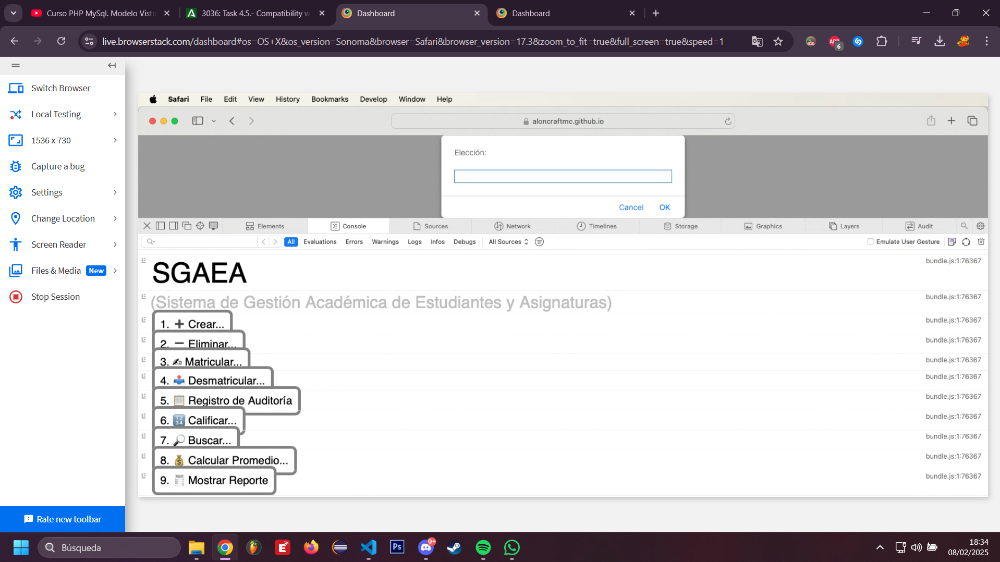

# Tarea 4.5 
> Alonso Hernández Robles 2º DAW AULA

## 1. Instalación y Configuración del Entorno

En primer lugar, he descargado Node.js desde su web oficial [https://nodejs.org/es](https://nodejs.org/es).

Para asegurarme que la instalación ha tenido éxito he puesto en la PowerShell:

```bash
node -v
npm -v
```

para obtener las versiones de Node y el Node Package Manager.

Después, he hecho:

```bash
npm init -y
```

Ahora tengo mi archivo `package.json`.

Ahora ejecutaré el siguiente comando para instalar webpack, babel y algunas dependencias:

```bash
npm install --save-dev webpack webpack-cli webpack-dev-server babel-loader @babel/core @babel/preset-env @babel/polyfill html-webpack-plugin clean-webpack-plugin
```

A continuación, he creado un archivo llamado `.babelrc` con el siguiente contenido:

```json
{
    "presets": ["@babel/preset-env"]
}
```

y un archivo llamado `webpack.config.js`, con el siguiente contenido:

```js
const path = require('path');
const HtmlWebpackPlugin = require('html-webpack-plugin');
const { CleanWebpackPlugin } = require('clean-webpack-plugin');

module.exports = {
entry: ['@babel/polyfill', './main.js'],
output: {
    filename: 'bundle.js',
    path: path.resolve(__dirname, 'dist')
},
module: {
    rules: [
    {
        test: /\.js$/,
        exclude: /node_modules/,
        use: {
        loader: 'babel-loader'
        }
    },
    {
        test: /\.ttf$/,
        type: 'asset/resource'
    }
    ]
},
plugins: [
    new CleanWebpackPlugin(),
    new HtmlWebpackPlugin({
    template: './index.html'
    })
],
mode: 'production'
};
```

Ahora, en `package.json` añado las siguientes líneas al array de scripts:

```json
"scripts": {
    "build": "webpack",
    "start": "webpack serve --open"
}
```

## 2. Compilación y Subida del Código

Para compilar el código, ejecuto mi script `build` en la terminal:

```bash
npm run build
```

y ahora tengo una carpeta llamada `dist/` con mi código compilado.

Para subir el código, voy a usar el hosting estático ofrecido por GitHub Pages. Para ello, subo mi carpeta `dist/` a mi repositorio remoto en GitHub gracias a Git.

He ejecutado los siguientes comandos, respectivos al repositorio local que ya tenía creado:

```bash
git add .
git commit -m "Tarea 4.5 Nueva Entrega"
git push
```

Ahora la carpeta se encuentra en:

- Código: [https://github.com/AloncraftMC/DWEC_VIEW_HernandezRobles_Alonso/tree/master/SGAEA/Tarea_4_5/dist](https://github.com/AloncraftMC/DWEC_VIEW_HernandezRobles_Alonso/tree/master/SGAEA/Tarea_4_5/dist)
- Aplicación: [https://aloncraftmc.github.io/DWEC_VIEW_HernandezRobles_Alonso/SGAEA/Tarea_4_5/index.html](https://aloncraftmc.github.io/DWEC_VIEW_HernandezRobles_Alonso/SGAEA/Tarea_4_5/index.html).

## 3. Prueba del Código en Navegador Antiguo

Ahora probemos la aplicación alojada en el enlace recién mencionado en un navegador antiguo, como Safari 17.3. Esto lo he logrado creándome una cuenta en [BrowserStack.com](BrowserStack.com).

Después, he elegido este navegador para probar mi codigo, y como se puede ver en la imagen, la [URL](https://aloncraftmc.github.io/DWEC_VIEW_HernandezRobles_Alonso/SGAEA/Tarea_4_5/index.html) funciona perfectamente con el código en la consola:

