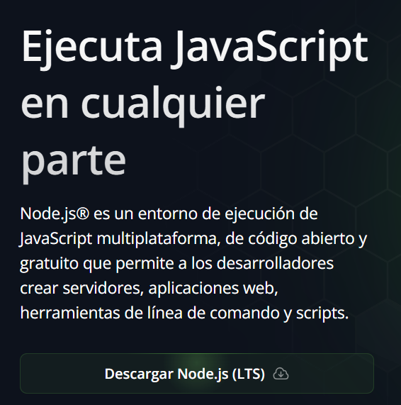
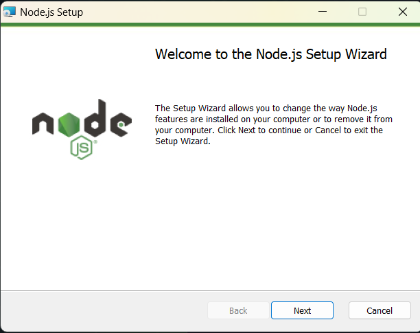
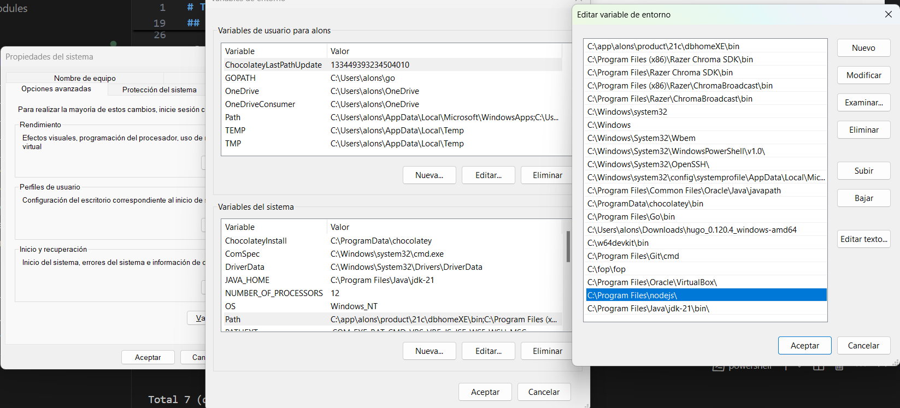
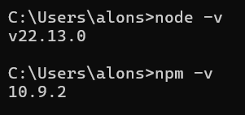
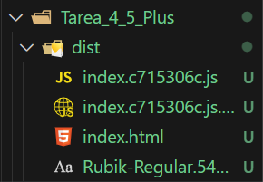

# Tarea 4.5 Plus - Polyfilleo y Transpilación con Parcel

Alonso Hernández Robles 2º DAW AULA

> Install and configure node, webpack and babel to polyfill and transpile your code so it runs in older browsers. Upload a file with a link to your github repository and place a comment with your github repository URL
> 
> **Optional: Create a new project with node and parcel or vite to do the same and document the process. A success will mean +1 at your final score.**

---

## Índice

- [1. Preparación de Software](#1-preparación-de-software)
    - [1.1. Node.js](#11-nodejs)
    - [1.2. Aplicación SGAEA](#12-aplicación-sgaea)
- [2. Despliegue con Parcel](#2-despliegue-con-parcel)

---

## 1. Preparación de Software

### 1.1. Node.js

En primer lugar, cabe aclarar que la carpeta raíz del proyecto es `Desarrollo Web Cliente`, la cual es la misma que el directorio raíz del repositorio.

Esta acción se ha cometido en esta tarea adicional y en todas las obligatorias tareas anteriores con la intención de evitar tener duplicada la carpeta `node_modules/` y así ganar en practicidad para la elaboración de tareas.

Sin embargo, se detallarán los pasos desde cero para el objetivo de completar la tarea. Para ello, es preciso comenzar instalando *Node.js*. Esto se puede conseguir desde la web oficial de Node ([https://nodejs.org/es](https://nodejs.org/es)), presionando en **Descargar Node.js (LTS)**.



Una vez se tenga descargado el archivo `.msi`, se podrá ejecutar y se deberá instalar siguiendo los pasos detallados en el proceso de instalación.



Al final del mismo, es preciso asegurarse de que la ruta de instalación de *Node.js* ha sido agregada a la variable de entorno PATH.



Ahora, si se abre un nuevo terminal `cmd.exe` o `powershell.exe` y se ejecutan los comandos

```bash
node -v
```

y/o

```bash
npm -v
```

se deberían ver las versiones de *Node.js* y el *Node Package Manager*.



### 1.2. Aplicación SGAEA

Una vez instalado *Node.js*, se procederá a la elaboración del código JavaScript de la tarea relacionada a SGAEA. Ya que esta presente tarea es posterior a su elaboración, se dará por hecha la recién citada, su manejo de errores, documentación con *JSDoc* y modularización.

Es por estos motivos que se creará una carpeta con la ruta relativa `./SGAEA/Tarea_4_5_Plus/` a partir de la raíz del repositorio (`.../Desarrollo Web Cliente/`) para incluir ahí los archivos `.js` junto a la documentación JSDoc, listos para ser empaquetados usando polyfilling y transpilación mediante la tecnología *Parcel*.

Para aclarar, la carpeta `Tarea_4_5_Plus/` se queda con los siguientes ficheros específicamente:

| Archivo | Descripción |
| - | - |
| `docmedia/` | Carpeta donde se encuentra este mismo documento Markdown junto a las imágenes requeridas para su compilación en PDF. |
| `docs/` | Carpeta generada por *JSDoc* con la documentación relativa al código de la aplicación, todo ello antes del polyfilling y la transpilación. |
| `index.html` | Página donde se despliega la aplicación. |
| `Rubik-Regular.ttf` | Fuente para que funcionen los estilos. |
| `main.js` | Programa con el flujo principal JavaScript, llamado por `index.html`. |
| `direccion.js` | Clase `Dirección` |
| `estudiante.js` | Clase `Estudiante` |
| `asignatura.js` | Clase `Asignatura` |
| `lista.js` | Clase `Lista` |
| `listaEstudiantes.js` | Clase `ListaEstudiantes` |
| `listaAsignaturas.js` | Clase `ListaAsignaturas` |

No se ha mencionado antes, pero antes de empezar a desarrollar la aplicación, es recomendable inicializar un nuevo proyecto de *Node*. Si no se ha hecho ya, es el momento de hacerlo, para poder instalar los posteriores paquetes y dependencias. Para inicializar un nuevo proyecto de *Node* en la carpeta actual, basta con ejecutar el comando:

```bash
npm init -y
```

El modificador `-y` rellena los campos de la inicialización por defecto.

## 2. Despliegue con Parcel

Una vez se tiene el proyecto de *Node.js* completado con todos los archivos `.js`, se procede a la instalación de *Parcel*. Para ello basta con escribir en la terminal de Visual Studio Code:

```bash
npm install --save-dev parcel
```

El modificador `--save-dev` instalará la dependencia de desarrollo sólo para el proyecto actual. Si se quisiera instalar globalmente, se debe usar el modificador `-g`.

Ahora, se debe asegurar que las dependencias necesarias, es decir, *Babel* y los polyfills, estén instaladas. Esto se puede comprobar o instalar directamente con la siguiente orden:

```bash
npm install --save-dev @babel-core @babel/preset-env core-js
```

Una vez realizadas estas tareas, se deben añadir dos nuevos scripts al array homónimo en el archivo generado por *Node.js* en el directorio raíz `package.json`, denominados `start` (para iniciar un servidor destinado al desarrollo) y `build` (destinado a la producción).

```json
"start": "parcel SGAEA/Tarea_4_5_Plus/index.html",
"build": "parcel build SGAEA/Tarea_4_5_Plus/index.html --dist-dir SGAEA/Tarea_4_5_Plus/dist"
```

<div style="page-break-before: always;"></div>

Tras añadir estas dos líneas al array `scripts`, el archivo `package.json` queda de la siguiente forma en este ejemplo en concreto, resultado de haber ya realizado las 4 tareas anteriores:

```json
{
    "name": "desarrollo-web-cliente",
    "version": "1.0.0",
    "description": "Esta es la descripción",
    "main": "index.js",
    "scripts": {
        "doc4_3": "jsdoc -c jsdoc.json SGAEA/Tarea_4_3/script.js -d  SGAEA/Tarea_4_3/docs -p",
        "doc4_4": "jsdoc -c jsdoc.json SGAEA/Tarea_4_4/main.js -d  SGAEA/Tarea_4_4/docs -p",
        "docPruebas": "jsdoc Pruebas/Prueba/script.js -d Pruebas/Prueba/docs -p",
        "test": "echo \"Error: no test specified\" && exit 1",
        "buildWebpack": "webpack",
        "start": "parcel SGAEA/Tarea_4_5_Plus/index.html",
        "build": "parcel build SGAEA/Tarea_4_5_Plus/index.html --dist-dir SGAEA/Tarea_4_5_Plus/dist"
    },
    "repository": {
        "type": "git",
        "url": "git+https://github.com/AloncraftMC/DWEC_VIEW_HernandezRobles_Alonso.git"
    },
    "author": "AloncraftMC",
    "license": "ISC",
    "bugs": {
        "url": "https://github.com/AloncraftMC/DWEC_VIEW_HernandezRobles_Alonso/issues"
    },
    "homepage": "https://github.com/AloncraftMC/DWEC_VIEW_HernandezRobles_Alonso#readme",
    "devDependencies": {
        "@babel/core": "^7.26.0",
        "@babel/preset-env": "^7.26.0",
        "babel-loader": "^9.2.1",
        "core-js": "^3.40.0",
        "jsdoc": "^4.0.4",
        "jsdoc-to-markdown": "^9.1.1",
        "minami": "^1.2.3",
        "parcel": "^2.13.3",
        "taffydb": "^2.7.3",
        "webpack": "^5.97.1",
        "webpack-cli": "^6.0.1"
    }
}
```

<div style="page-break-before: always;"></div>

Luego de haber realizado todas las instrucciones anteriores, debería de poderse ejecutar el script de levantamiento del servidor con:

```bash
npm run start
```

Si todo ha funcionado correctamente, la aplicación debería poder ser empaquetada enteramente ahora ya sí con el script:

```bash
npm run build
```

Tras ejecutar el anterior comando, debería haber aparecido un nuevo directorio dentro de `SGAEA/Tarea_4_5_Plus/` llamado `dist/`. Contendrá 4 archivos en teoría:

| Archivo | Descripción |
| - | - |
| `index.html` | Equivalente al `index.html` que ya se tenía anteriormente, pero empaquetado.
| `index.c715306c.js` | El archivo JavaScript con todo el código polyfilleado y transpilado. `index.html` apunta ahora aquí.
| `index.c715306c.js.map` | Mapa que describe la asociación entre el código transpilado y sin transpilar.
| `Rubik-Regular.5480d46b.ttf` | Fuente tipográfica anterior.

Esta carpeta `dist/` es la que funcionará en un servidor si se llega a alojar en él. Contiene todos los recursos a usar para desplegar de forma definitiva la aplicación web SGAEA.

